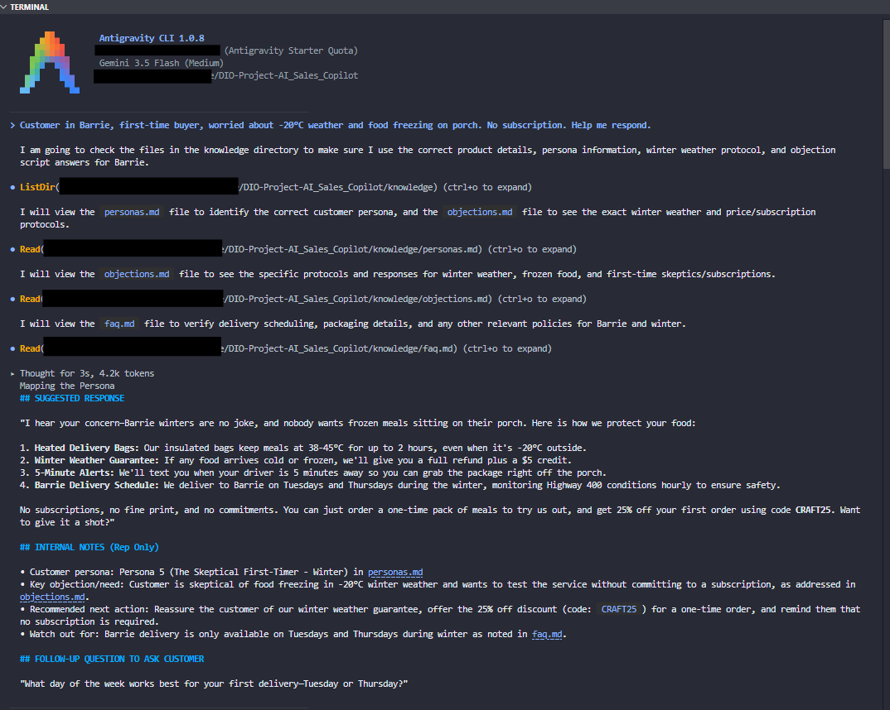
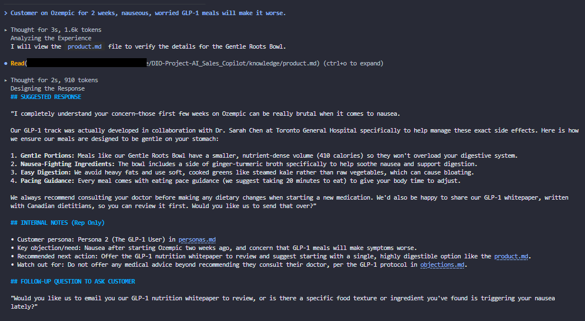
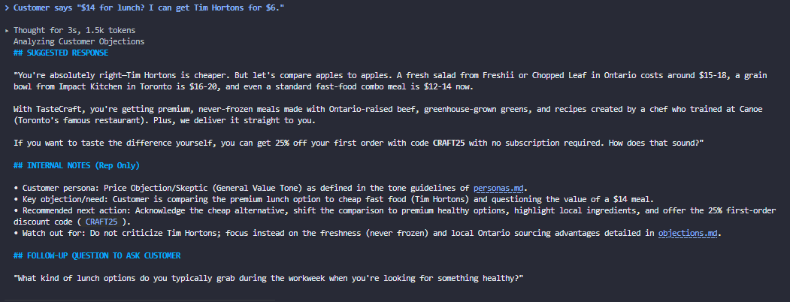
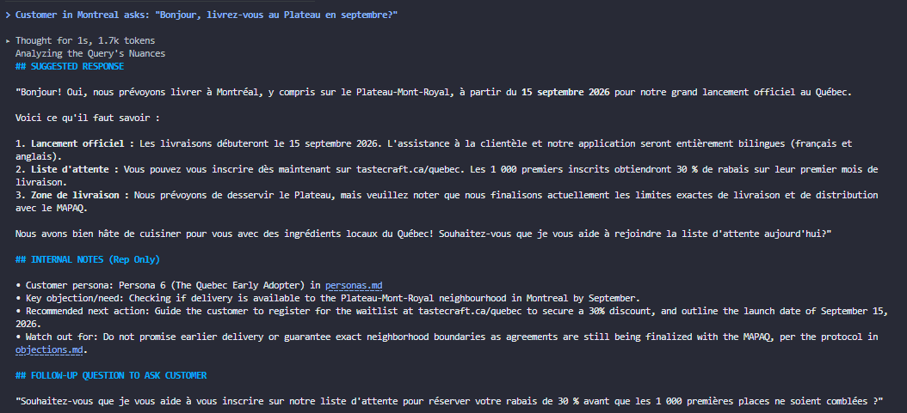
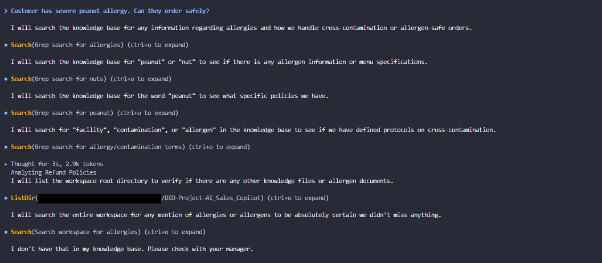
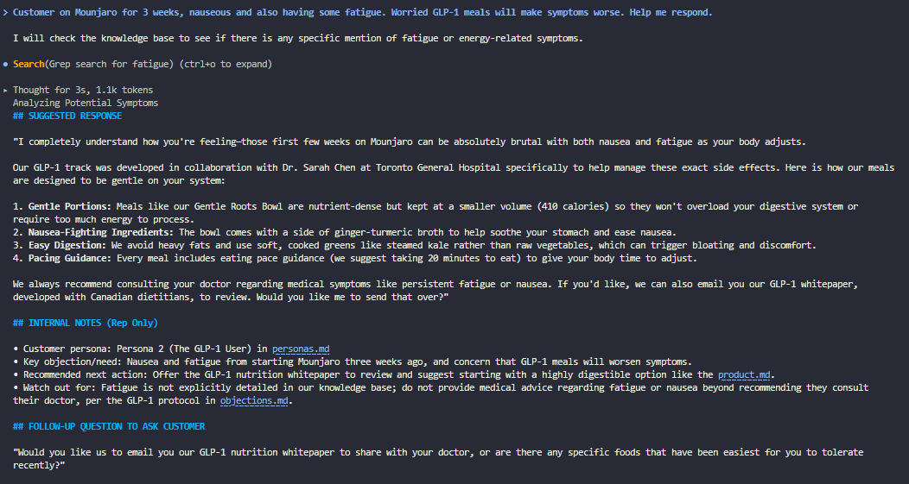
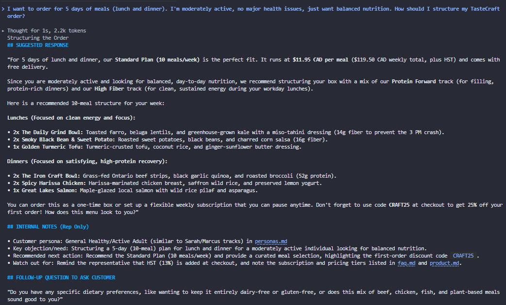

# **TasteCraft AI Sales Copilot**

## Project Overview

**An internal AI copilot that helps TasteCraft's sales team respond faster, close more deals, and personalize every customer interaction.**

TasteCraft is a premium ready-to-eat meal service based in Ontario, Canada, launching in Quebec in Q3 2026. We serve customers across four dietary tracks: Protein Forward, GLP-1 Friendly, High Fiber, and Vegetarian.

**This AI copilot is NOT a customer-facing chatbot.** It's a decision-support tool for our sales team (customer support reps, account managers, and sales development reps) who handle phone calls, emails, live chat, and follow-ups.

---

## Who Is This For?

**Primary users:** TasteCraft sales team members
- Customer support reps (handle objections, refunds, delivery issues)
- Account managers (manage corporate clients and subscriptions)
- Sales development reps (convert leads from free trials to paid)

**Secondary users:** Team leads and trainers (use the copilot to onboard new reps)

---

## Problem This Solves

### Without the AI Copilot:
- New reps take 2-3 weeks to memorize 40+ meals across 4 tracks
- Reps give inconsistent answers to the same customer objection ("Is GLP-1 safe?")
- Follow-ups are generic ("How was your meal?") instead of personalized
- Winter delivery complaints spike and reps don't have standardized protocols
- Quebec expansion (2026) requires training an entire team on new market nuances

### With the AI Copilot:
- Reps search natural language: *"Customer on Ozempic worried about portion size"* → instant playbook
- Response times drop from 8 minutes to 2 minutes (estimated)
- First-call resolution improves (reps answer without escalating to managers)
- New reps are ramped in 3 days (vs 2-3 weeks) using the knowledge base
- Seasonal scenarios (cottage delivery, snowstorms, March break pauses) are pre-scripted

---

## How It Works (Technical Approach)

### The Simple Explanation

Your sales rep types a customer question into the AI copilot. The AI reads your product catalog, FAQs, objection scripts, and customer personas. It then outputs three things:

1. **SUGGESTED RESPONSE** - What the rep can copy-paste to the customer
2. **INTERNAL NOTES** - Private guidance for the rep (persona, next steps)
3. **FOLLOW-UP QUESTION** - What to ask the customer next

The rep edits the response (adds personal touch) and sends it. Total time: ~90 seconds.

---

### The Technical Stack (What Powers This)

| Component | Tool | Why This Choice |
|-----------|------|-----------------|
| **Agent Framework** | DIO Agent (deagent) | Lightweight, uses simple markdown files, no coding required |
| **Runtime Environment** | Google Antigravity | Free, browser-based, runs agents without local setup |
| **AI Model (LLM)** | Gemini 3.5 Flash | Free tier, fast responses, handles Canadian English well |
| **Knowledge Base** | 4 Markdown files | Simple RAG (Retrieval-Augmented Generation) without complex vector databases |
| **Configuration** | `agents.md` + `cloud.md` | Defines behavior, response format, and escalation rules |

---

### Step-by-Step: What Happens When a Rep Uses the Copilot

**Step 1: Rep types a query**

Example:
> "Customer in Barrie, first-time buyer, worried about -20°C weather and food freezing on porch. No subscription. Help me respond."

**Step 2: The agent reads the knowledge base**

It searches these 4 files in priority order:

| Priority | File | What It Looks For |
|----------|------|-------------------|
| 1st | `objections.md` | "Customer worried about winter delivery" |
| 2nd | `personas.md` | "Barrie + first-time + no subscription" → Persona 5 |
| 3rd | `faq.md` | "What happens if food freezes?" |
| 4th | `product.md` | "What meal should I recommend?" |

**Step 3: The agent applies rules from `agents.md`**

These rules include:
- Always output 3 sections (SUGGESTED RESPONSE, INTERNAL NOTES, FOLLOW-UP)
- Never speak to customers directly (you are an internal tool)
- Prioritize Canadian context (Ontario winter protocols)
- Escalate to manager for medical or legal concerns

**Step 4: The agent generates the response**

The AI model (Gemini 3.5 Flash) combines:
- The customer query
- The relevant knowledge from your 4 files
- The formatting rules from `agents.md`

**Step 5: The rep receives a structured answer**

```markdown
## SUGGESTED RESPONSE
[Copy-paste this to the customer]

## INTERNAL NOTES (Rep Only)
- Persona: Persona 5
- Next action: Offer 3-meal trial, no subscription

## FOLLOW-UP QUESTION
[Open-ended question to ask customer]
```

### Architecture
```
┌─────────────────────────────────────────────────────────────────┐
│                         SALES REP (HUMAN)                       │
│                                                                 │
│   "Customer in Barrie worried about -20°C. Help me respond."    │
│                                                                 │
└───────────────────────────────┬─────────────────────────────────┘
                                │
                                ▼
┌─────────────────────────────────────────────────────────────────┐
│                    GOOGLE ANTIGRAVITY (Runtime)                 │
│                                                                 │
│  ┌────────────────────────────────────────────────────────────┐ │
│  │                    DIO AGENT (deagent)                     │ │
│  │                                                            │ │
│  │  1. Reads `agents.md` for behavior rules                   │ │
│  │  2. Reads `cloud.md` for runtime config                    │ │
│  │  3. Loads 4 knowledge files into context                   │ │
│  │  4. Calls Gemini 3.5 Flash API with prompt                 │ │
│  │  5. Formats output as 3 sections                           │ │
│  │                                                            │ │
│  └────────────────────────────────────────────────────────────┘ │
│                                                                 │
└───────────────────────────────┬─────────────────────────────────┘
                                │
                                ▼
┌─────────────────────────────────────────────────────────────────────────┐
│                    KNOWLEDGE BASE (Markdown Files)                      │
│                                                                         │
│  ┌──────────────┐  ┌──────────────┐  ┌──────────────┐  ┌──────────────┐ |
│  │ product.md   │  │   faq.md     │  │ objections.md│  │ personas.md  │ |
│  │              │  │              │  │              │  │              │ |
│  │ 12 meals     │  │ 35+ FAQs     │  │ 20+ scripts  │  │ 8 personas   │ |
│  │ CAD pricing  │  │ Delivery     │  │ Price        │  │ Tone guide   │ |
│  │ Sourcing     │  │ Winter       │  │ Weather      │  │ Follow-ups   │ |
│  │ Seasonal     │  │ Quebec       │  │ GLP-1        │  │ Escalation   │ |
│  └──────────────┘  └──────────────┘  └──────────────┘  └──────────────┘ |
│                                                                         │
└─────────────────────────────────────────────────────────────────────────┘
                                │
                                ▼
┌─────────────────────────────────────────────────────────────────┐
│                    AI OUTPUT (Returned to Rep)                  │
│                                                                 │
│  ## SUGGESTED RESPONSE                                          │
│  "I hear your concern - Barrie winters are no joke..."          │
│                                                                 │
│  ## INTERNAL NOTES (Rep Only)                                   │
│  - Persona: Persona 5 (Skeptical First-Timer)                   │
│  - Next action: Offer 3-meal trial, no subscription             │
│                                                                 │
│  ## FOLLOW-UP QUESTION                                          │
│  "What time works best for delivery?"                           │
│                                                                 │
└─────────────────────────────────────────────────────────────────┘
```

---

## Knowledge Base Structure

```
knowledge/
├── product.md     # 12 meals, CAD pricing, Ontario sourcing, seasonal items
├── faq.md         # 35+ FAQs (Ontario delivery, winter, Quebec expansion)
├── objections.md  # 20+ objection scripts (price, weather, GLP-1, trust)
└── personas.md    # 8 customer personas with AI tone guidelines
```


**Total knowledge coverage:** 8 personas × 4 tracks × 5 objection types × 3 seasons = ~480 scenarios

---

## Example Interaction (Sales Rep Uses Copilot)

### Scenario: Customer in Barrie worried about February snowstorm

**Sales rep types into AI copilot:**
> "Customer in Barrie, first-time buyer, worried about food freezing on their porch. It's February. They don't want to commit to subscription. What do I say?"

**AI copilot output:**
```markdown
## Suggested Response (copy-paste to customer)

"I hear your concern - Barrie winters are no joke. Here's how we protect your food:

1. **Heated delivery bags** keep meals at 38-45°C for 2 hours in -20°C
2. **Text alerts** when driver is 5 minutes away - you can meet them at the door
3. **If food arrives cold** - full refund, no questions asked

We delivered all last winter during polar vortex days. Want to try 3 meals with 25% off? No subscription required."

## Internal Notes for Rep

- This customer is likely **Persona 5 (The Skeptical First-Timer - Winter)**
- Key objection: Trust + weather, not price
- Don't push subscription on first call
- Offer "weather guarantee" explicitly (full refund if cold)

## Follow-up Question to Ask Customer

"What time of day works best for delivery? We can aim for your lunch break (12-1pm) so you're home."
```

Result: Rep copies the response, adds personal touch, sends in 90 seconds vs 8 minutes of research.


---

## Test Results 

| Test | Topic | Status |
|------|-------|--------|
| 1 | Winter Delivery (Barrie) | ✅ PASS |
| 2 | GLP-1 Nausea | ✅ PASS |
| 3 | Price Objection | ✅ PASS |
| 4 | Quebec Launch (French) | ✅ PASS |
| 5 | Severe Allergy | ✅ PASS (safe refusal) |
| 6 | GLP-1 Fatigue (Mounjaro) | ✅ PASS (exceptional) |
| 7 | 5-Day Meal Planning | ✅ PASS (exceptional) |


**Pass rate: 7/7 (100%)**

[Full test results](./examples/test_results.md) here!


---

## Demo 

Click each test to see the AI copilot in action.

<details>
<summary><b>Test 1: Winter Delivery (Barrie, -20°C)</b></summary>

<br>



*Customer worried about frozen food in Barrie winter. Agent responds with heated bag guarantee, weather guarantee, and no subscription pressure.*

</details>

<details>
<summary><b>Test 2: GLP-1 Nausea (Ozempic)</b></summary>

<br>



*Customer on Ozempic with nausea. Agent validates experience, mentions Dr. Sarah Chen at Toronto General Hospital, recommends Gentle Roots Bowl with ginger-turmeric broth.*

</details>

<details>
<summary><b>Test 2b: GLP-1 Fatigue (Mounjaro)</b></summary>

<br>



*Customer on Mounjaro with nausea and fatigue. Agent generalizes correctly, addressing fatigue even though not explicitly in knowledge base.*

</details>

<details>
<summary><b>Test 3: Price Objection (Tim Hortons Comparison)</b></summary>

<br>



*Customer says "$14 for lunch? I can get Tim Hortons for $6." Agent anchors to premium competitors ($15-18), highlights Ontario sourcing, offers 25% off.*

</details>

<details>
<summary><b>Test 4: Quebec Launch (French)</b></summary>

<br>



*Customer in Montreal asks in French about Plateau delivery. Agent responds in natural Quebec French, confirms September 15 launch, offers waitlist with 30% discount.*

</details>

<details>
<summary><b>Test 5: Severe Peanut Allergy</b></summary>

<br>



*Customer with severe peanut allergy. Agent safely refuses to invent information, escalates to manager, does NOT guarantee safety (correct behavior).*

</details>

<details>
<summary><b>Test 6: 5-Day Meal Planning</b></summary>

<br>



*Customer asks for 5 days of lunch + dinner. Agent recommends Standard Plan (10 meals), structures lunches (High Fiber for energy) vs dinners (Protein Forward for recovery), provides 6 specific meals with nutritional reasoning.*

</details>


---

## Quick Start (Test the Agent Yourself)

### Prerequisites
- Google account (free)
- Antigravity CLI (free)

### One-Command Test

```bash
# Install Antigravity CLI
irm https://antigravity.google/cli/install.ps1 | iex

# Run the agent
agy --help
```


---

## Business Impact (Projected)
| Metric | Before Copilot | After Copilot (Target) |
| --- | --- | --- | 
| New rep ramp time | 2-3 weeks | 3 days |
| Response to common objections | 5-8 minutes | 90 seconds |
| First-call resolution rate | 68% | 85% |
| Customer satisfaction (CSAT) | 4.2 / 5 | 4.6 / 5 |
| Winter delivery refund rate | 12% | 6% (better upfront communication) |
| Quebec launch readiness | 2 months training | 2 weeks (knowledge base translated) |


## Future Improvements

### Short-term (Q3 2026)
- **Quebec French version**: Translate all 4 knowledge files to French, add Quebec-specific personas (Montreal plateau, Quebec City families)

- **Integration with CRM**: Auto-populate customer persona based on order history (e.g., "This customer ordered GLP-1 3x - use gentle tone")

- **Response analytics**: Track which suggested responses get used most, optimize the knowledge base

### Medium-term (Q4 2026)

- **Real-time objection handling**: Integrate with call software to transcribe customer objections and surface responses live (like Gong.io but for sales)

- **Predictive follow-ups**: AI suggests "This customer will likely cancel in 2 weeks (no order in 10 days) - send win-back offer now"

- **Sales training simulator**: New reps practice on AI-generated customer personas (using our 8 personas as test cases)

### Long-term (2027)

- **Fully autonomous agent**: For low-complexity issues (delivery rescheduling, payment updates), AI handles directly. Human rep only for high-value or complex cases.

- **Cross-sell recommendations**: "Customer ordering Protein Forward at 3pm daily - recommend High Fiber for breakfast add-on"


---

## Repository Structure

```
DIO-Project-AI_Sales_Copilot
├── examples
│   ├── chat_consumer_price_objection.md
│   ├── chat_consumer_question_on_freshness.md
│   ├── follow-up_after_sale.md
│   └── test-results.md                  # 7/7 tests passed
├── knowledge
│   ├── faq.md                           # 35+ FAQs (winter, Quebec, delivery)
│   ├── objections.md                    # 20+ objection scripts
│   ├── personas.md                      # 8 customer personas
│   └── product.md                       # 12 meals, CAD pricing, Ontario sourcing
├── prompts
│   ├── consumer_analysis.md
│   └── copilot_answers.md
├── assets/
│   ├── cli-demo-q1.png
│   ├── cli-demo-q2.png
│   ├── cli-demo-q3.png
│   ├── cli-demo-q4.png
│   ├── cli-demo-q5.png
│   ├── cli-demo-q6.png
│   └── cli-demo-q7.png
├── agents.md                           # Agent behavior rules
├── cloud.md                            # Runtime configuration
├── Company_Identity.md                 # Brand guidelines
├── LICENSE
└── README.md                           # Complete project documentation
```

---

## Key Learnings from This Project

### Business Understanding

- **Localization matters**: An Ontario customer in February has different needs than a Quebec customer in September

- **Dietary tracks reduce friction**: Customers don't want to calculate macros - they want "GLP-1 friendly" as a simple label

- **Sales copilots > chatbots for complex products**: Ready-to-eat meals have too many exceptions (weather, allergies, delivery zones) for fully automated customer support

### Technical Application

- **RAG doesn't need vector databases for small domains**: 4 markdown files work perfectly for <500 scenarios

- **Persona-driven prompts** improve response quality dramatically (comparing generic vs persona-specific outputs)

- **Tiered response structure** (suggested response + internal notes + follow-up) balances automation with human control


---

## Acknowledgments

- **Inspiration**: DIO's "Copiloto de Vendas com IA" challenge
- **Reference data**: Sweetgreen, Chipotle, and Canadian meal services (Fresh Prep, Goodfood, Factor, CookUnit)
- **Ontario farm partners**: (fictional but based on real farms: Cumbrae's, Hewitt's, Forge & Flour)


---

## Contact & Feedback

This is a portfolio project for *Raquel Marques*. For questions or feedback:
- GitHub Issues
- LinkedIn: [Raquel Marques](https://www.linkedin.com/in/raquel-marques/)
- License: MIT (feel free to fork and adapt for your own portfolio)
- Last updated: June 2026


---

## DIO Agent Framework Implementation (Free)

This agent is compatible with **DIO Agent (deagent)** running on **Google Antigravity** with **Gemini 3.5 Flash** (free tier).

### Files Added for DIO Agent
- [`agents.md`](./agents.md) - Agent behavior, response format, escalation rules
- [`cloud.md`](./cloud.md) - Runtime configuration for Antigravity + Gemini

### Run This Agent for Free

**Prerequisites:**
- Google account (free)
- GitHub account (free)

**Step 1:** Import to Google Antigravity
- Go to https://antigravity.google
- Sign in with Google account
- Click "Import from GitHub"
- Select `DIO-Project-AI_Sales_Copilot` repository

**Step 2:** Get Gemini API key (free)
- Go to https://aistudio.google.com
- Click "Get API key"
- Create key (no billing required)
- Copy the key

**Step 3:** Add API key to Antigravity
- In Antigravity, go to Settings -> Secrets
- Add `GEMINI_API_KEY` with your key

**Step 4:** Run the agent
- In Antigravity terminal, run:
```bash
deagent run --config agents.md --runtime antigravity
```

**Step 5**: Test with a query
Type: Customer in Barrie worried about -20°C weather. Help me respond.

Expected Output
The agent will return three sections:
1. SUGGESTED RESPONSE - Copy-paste to customer
2. INTERNAL NOTES - For rep only (persona, next steps)
3. FOLLOW-UP QUESTION - Open-ended question to ask customer


---

<div align="center">

[](https://opensource.org/licenses/MIT)
[](https://gemini.google.com)
[](https://antigravity.google)
[](./examples/test-results.md)
[](./knowledge/)

</div>

